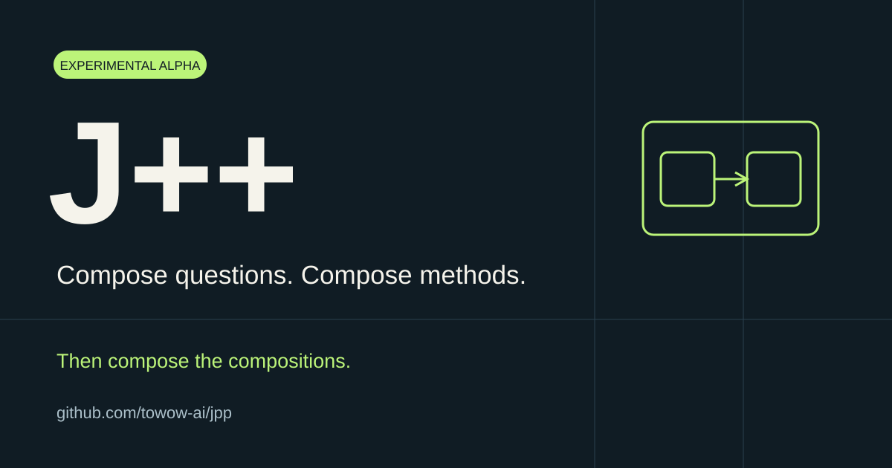

# J++



**Compose questions. Compose methods. Compose the compositions.**

[简体中文](README.zh-CN.md) · [Why J++](docs/why-jpp.md) · [Progress](docs/progress.md) · [Language design & grammar](docs/design.md) · [Contributing](CONTRIBUTING.md)

J++ is an experimental programming-language project exploring semantic judgment as a programmable operation. Questions are values. Methods are values. A composed method can become a building block in another method.

The current implementation is a **Python 3.12 embedded language**, with a runtime and a composition library. It combines JEV-style judgments with ordinary computation, candidate generation, exact checks, and feedback. Independent syntax and a standalone compiler are future work.

## Why we are doing this

We are drawn to a familiar power of algorithms: a few simple operations, organized well, can accomplish something surprisingly complex. JEV led us to ask what happens when semantic judgment joins those operations, alongside exact computation, search and feedback.

Our intuition is that questions and solving methods should be reusable values. A program should be able to construct its next question, accept a method as an argument, and return a method that another program can use. The resulting composition should remain a building block.

We do not yet know every application this will enable. We want others to construct methods we did not anticipate. Working components and executable examples let experience shape the language. [Read the project origin and design motivation](docs/why-jpp.md).

Our first application question comes from Towow: can a fuzzy intent meet different participants' local contexts to produce new cooperation possibilities, with ongoing results and candidate combinations participating in further discovery? [Read the research proposal (中文)](docs/first-problem-towow.zh-CN.md).

The first application is the **Towow discovery lab**. Explore [216 participants and 20 intents](https://towow-ai.github.io/jpp/demos/towow/population/), inspect profiles and compare a semantic-plus-lexical method against BM25, or [disable referral/composition in the ten-person experiment](https://towow-ai.github.io/jpp/demos/towow/lab/). Both pages execute the current J++ Python sources in the browser using published real JEV response recordings. [Animated explanation](https://towow-ai.github.io/jpp/) · [Measurements and reproduction (中文)](docs/towow-demo.zh-CN.md).

The [325-profile real-source comparison](https://towow-ai.github.io/jpp/demos/towow/real/) evaluates seven retrieval/judgment compositions against 963 historical proxy relation labels. Inspect individual candidates, regressions, exact response recordings and offline reproduction. [Results and evaluation scope (中文)](docs/towow-real-relations-results.zh-CN.md).

## Try it


```sh
git clone https://github.com/towow-ai/jpp.git
cd jpp
python3.12 -m venv .venv
source .venv/bin/activate
python -m pip install -e '.[dev]'
jpp demo
jpp methods --output method-report.json
python -m pytest -q
```

Windows: activate with `.venv\Scripts\activate` instead.

The `methods` command runs complete dynamically constructed methods and saves
their plan, generated structures and execution results. You can also install the
built wheel without a source checkout. [Write your own methods and inspect a run](docs/developer-guide.md).

The demo runs offline with no API key or API charges. It identifies a target among 1,000 candidates using at most 10 adaptive binary questions, then constructs an expression using counterexamples and checks all nine declared inputs. The answers are synthetic and the generator is finite enumeration: this demonstrates the execution and composition mechanisms, not real-model accuracy or a new search algorithm.

## A method stays a method

```python
from jev_compose import component, execute
from jev_compose.fixtures import runtime

@component("length", str, int)
def length(text):
    return len(text)

@component("double", int, int)
def double(n):
    return n * 2

method = length.then(double)
assert execute(method, "hello", runtime()).value == 10
```

The same interface supports methods that ask questions, choose subsequent methods, or iterate over feedback. `inquire(...)` and `feedback(...)` are themselves composition constructors; their strategies can be replaced without changing the runtime.

## What is here

| Layer | Current implementation |
|---|---|
| Questions | Test, selection, and measurement; save and restore question values |
| Composition | Sequential composition, branches, products, dynamic method selection, bounded iteration |
| Algorithms | Adaptive inquiry and candidate/check/counterexample feedback |
| Uncertainty | Explicit unresolved observations and conditional count bounds |
| Runtime | Materials, judgment effects, generation/action hooks, budgets, records and replay |
| Distribution | Installable Python package, offline CLI demonstration and tests |

`src/foundation` contains the runtime; `src/jev_compose` contains the composition layer; `src/jpp` provides the distribution entry point. Existing import names remain available while the language design develops.

This is an early alpha. APIs may change. Real-model quality requires separate evaluation; the default demo never contacts JEV. See [current scope and backend notes](docs/status.md).

## Help shape the language

Current research is clarifying question/material/result interfaces, improving examples for new readers, and exploring more algorithm constructions. The Towow example includes a first live-backend trace; broader backend evaluation and independent syntax remain subsequent milestones. [Dated progress report](docs/progress.md) · [Roadmap](ROADMAP.md).

The most useful contribution is a new method built from existing components, together with an example that runs. Tell us where composition becomes awkward, what you had to duplicate, and which primitive would eliminate that duplication. [Start here](CONTRIBUTING.md).

MIT licensed. J++ is an independent project, not an official JEV/TypeSafe product, and is unrelated to Microsoft's historical Visual J++.
