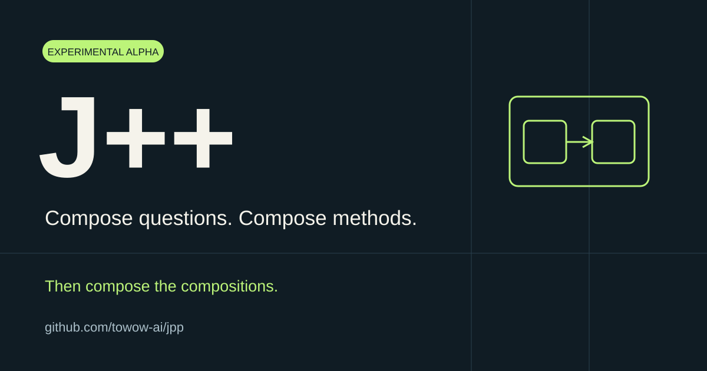

# J++



**Compose questions. Compose methods. Compose the compositions.**

[简体中文](README.zh-CN.md) · [Why J++](docs/why-jpp.md) · [Ecosystem reassessment](docs/updates/2026-09-23-ecosystem-reassessment.md) · [Progress](docs/progress.md) · [Language design & grammar](docs/design.md) · [Contributing](CONTRIBUTING.md)

J++ is an experimental programming-language project exploring semantic judgment as a programmable operation. Questions are values. Methods are values. A composed method can become a building block in another method.

**Write standalone `.jpp` source and run it with the native Rust implementation.** It parses source, checks language rules and executes methods through one shared kernel. The earlier Python 3.12 embedded implementation remains available as a behavior reference and experiment tool. [Rust package and examples](rust/README.md) · [Language implementation decision](docs/adr/0001-rust-kernel.md).

## Run standalone J++

You need Rust 1.85 or newer. Install the `jpp` command from the `rust/` folder and run programs from there (a program finds its libraries
next to its own file, and the installed command does not carry them):

```sh
git clone https://github.com/towow-ai/jpp.git
cd jpp/rust
cargo install --locked --path crates/jpp      # release build, about two minutes
jpp run examples/composition.jpp 2>/dev/null | tail -n 5
```

The last command prints `"value": {"expected": 43, "result": 43}`: a program that composes two small methods into a new one.
The other examples cover the three ways in: **a batch of items from one sentence of purpose** (`purpose_run`), **a process that keeps
changing** (`purpose_drive`, with a small world) and **modules you fill in yourself** (`modules_run`), plus filling in missing information
and replaying a run from its ledger. All five run offline on recorded answers at no cost. [Install, the examples and what J++ cannot do yet](rust/README.md)
· [the five examples](rust/examples/README.md) · [Grammar](rust/FRONTEND.md) · [Source and direct-core equivalence](rust/COMPARISON.md).

CI installs `jpp` on a clean Ubuntu and a clean macOS machine and runs the five examples with the installed binary, and it runs every code block in the
docs (and compares the output pasted under them) on each push; if any of them fails, CI is red.

Building needs Rust; the installed native executable runs without Python or Cargo.
Use the explicit executable path (`~/.cargo/bin/jpp`) if the retained Python `jpp` command is also installed.

[Next steps](ROADMAP.md): reusable source-library methods, consistent composition
rules and an application using standalone source.

## Demos / 演示

All demos live on one page: **[jpp.towow.net/demos/](https://jpp.towow.net/demos/)**. Cards 01–04 replay real runs; every number comes from that run's report and ledger. None of the cases is fully settled, and the pages say so.

所有演示都在这一页：**[jpp.towow.net/demos/](https://jpp.towow.net/demos/)**。01–04 回放真机运行，数字来自该次运行的报告与账本；05 同为真机录制回放（含负结果）。没有一个案子完全定案，页面照实写出。

**06 [Live speaker coach / 讲台提示](https://jpp.towow.net/demos/speaker/)** replays one real run. Every 3 seconds JEV reads a frozen snapshot of the audience (12 simulated faces reduced to four ratios), the latest transcript and the session profile, then answers two multiple-choice questions in one merged call (about 1.3 s): which action to cue, including "don't interrupt", and which section to steer toward. The audience is simulated from hidden preferences that JEV never sees; every judgment in the replay is a live JEV result.

**06 [讲台提示](https://jpp.towow.net/demos/speaker/)** 回放一场真机运行：每 3 秒把台下（12 张模拟的脸，汇总成四个比例）、最新字幕和本场画像冻结成一份材料，JEV 在一次合并调用里答两道选择题（约 1.3 秒）：提示讲者做什么（含「先不提示」）、往哪一节偏。观众由 JEV 看不到的隐藏偏好模拟，回放里每一拍的判断都是真机结果。

**07 [World compiled from the Harness ledger / Harness 的世界](https://jpp.towow.net/demos/world/)**: three months of one real Agent system's ledger (about 890,000 events) compiled into a viewable world with J++. JEV picks structure and procedure for 48 real construction tasks, about $0.07 total; the marginal cost of one fix session is $0.0000481. (incl. zoom-in and harbor pages)

**07 [Harness 的世界](https://jpp.towow.net/demos/world/)**：把三个月的 Agent 账本（约 89 万条事件）编译成 48 座在建的东西，JEV 选结构与工序，费用几美分；一次修复的单笔成本是 $0.0000481。（含放大进楼与港与城两页）


**09 [Towow network — open to join / 通爻网（可以接入）](https://jpp.towow.net/demos/towow-app/?replay=full)**: a stranger-discovery network for personal agents, written as one long-running J++x program ([`examples/towow-app`](examples/towow-app/README.en.md)). An agent joins with one line, `claude mcp add --transport http towow https://net.towow.ai/mcp` (Codex: `codex mcp add towow --url https://net.towow.ai/mcp`), and hands over only the public tier of its owner's context. JEV judges everyone present on the newcomer's own state, re-judges the top 200 with their full public packs, then judges pairs and multi-party configurations (referrals, chains, rings, teams, configurations of configurations). When a judgment is unsure the network asks the other side for one category of information, and formed groups get a written plan. Watch it live at [towow.ai](https://towow.ai). The public demo holds 500 fictional residents, and every counterpart is marked real or fictional; no two real people have met through it yet. In a 10,000-person recall probe (25 planted pairs; the network itself has not run at 10,000), true partners in the top 32 rose from 3/25 (vector top 200 + JEV re-rank) to 15/25 (two-stage JEV judgment of everyone present) (pre-registrations 08–10). On the 500-person network, one measured cold join cost about $0.11 in JEV tokens (plan generation not counted), and the client saw the first opportunity after about 17 s. Still open: hard negatives mostly hold (18 of 22, measured before the recall change), and mainline Rust J++ does not have continuous computation yet; J++x is an experimental dialect. [Replay of one real agent joining](https://jpp.towow.net/demos/towow-app/?replay=nature).

**09 [通爻网（可以接入）](https://jpp.towow.net/demos/towow-app/?replay=full)**：个人 agent 之间的陌生人合作发现网络，写成一个一直在算的 J++x 程序（[`examples/towow-app`](examples/towow-app/README.md)）。agent 用一行 `claude mcp add --transport http towow https://net.towow.ai/mcp` 接入（Codex：`codex mcp add towow --url https://net.towow.ai/mcp`），只交主人的公开层。JEV 在新人自己的状态上判断在场每一个人，前 200 名用完整公开包再判，再逐对、逐个构型（转介、链、环、团队、组合的组合）细判；拿不准时向对方要一类信息，成形的合作写成方案。实时画面在 [towow.ai](https://towow.ai)。公网演示里有 500 位虚构居民，每位对方都标明是真人还是虚构；还没有两位真人经它相遇。1 万人召回探针（25 对；网络本身没有在 1 万人跑过）里，真伙伴进前 32 由 3/25（向量前 200 + JEV 重排）升到 15/25（两段 JEV 判断在场全体）（预注册 08–10）；500 人网络上实测一次冷接入，JEV 花费约 $0.11（方案生成不计），客户端约 17 秒看到第一个机会。仍未解决：难负例多半被判成立（22 对里 18 对，改召回之前测的）；主线 Rust J++ 还没有持续计算，J++x 是实验方言。[一个真 agent 接入的回放](https://jpp.towow.net/demos/towow-app/?replay=nature)。

**A program given only a purpose / 只给一句目的的程序**: [`rust/examples/purpose-only.jpp`](rust/examples/purpose-only.jpp) hands one sentence of purpose and a small set of supplier records to `purpose_run`; the language writes the questions itself. On 2026-10-01 the same entry ran on the real judge over 400 companies and one résumé: 1,634 calls, $0.0857, no hand-written question text (details and what did not hold: [progress.md](docs/progress.md)). The shipped example is checked with `jpp check` only and has not been run live. 同一个入口 10-01 在真机上对 400 家公司和一份简历跑通：1,634 次调用，0.0857 美元，源码里没有手写题面；随仓示例只用 `jpp check` 验证过，没有真机运行。

**Two more real-machine targets / 又两个真机靶子** (2026-10-02): the same purpose-only entry ran on a GitHub issue-triage project (800 issues, 69.00% agreement with the maintainers' labels against 71.75% for the project's own code; $0.189 for the final arm, one elicitation only) and, through the new `env:step` process entry, on an arena game bot, where three rounds ran end to end but the bot did not reach a usable level of play. Numbers, what did not hold and what cannot be concluded: [progress.md](docs/progress.md). 同一个只给目的的入口在 GitHub issue 分诊项目上跑通（800 条 issue，与维护者标签一致率 69.00%，项目自己的代码是 71.75%；最终一臂 0.189 美元，只有一次引出），并通过新的 `env:step` 过程入口跑了一个竞技场游戏机器人：三圈端到端跑完，但机器人没有打出能用的水平。数字、没成立的预测和不能下的结论见 [progress.md](docs/progress.md)。

<sub>01–04：录于 2026-09-26，旧默认：没写线即拿不准；新默认下的重录在赛后 / Recorded 2026-09-26 under the old default (no line = unsure); re-recording under the new default comes after the contest.</sub>

- **01 Who is lying / 谁在说谎**: eight testimonies compared pair by pair. Cases A and B circle two people that include the culprit; in case C the program names Zhou Lin while the case design says Han Mei; some pairs stay uncertain in all three. / 八份证词两两对质。A、B 两案圈出的两人含真凶，C 案程序认定周琳而出题设定是韩梅，三案都仍有拿不准的证词对。
- **02 Hangzhou dinner / 杭州聚餐**: five people, 576 real OpenStreetMap restaurants; the program filters venues, seats guests and splits groups, about 270–305 judgments and $0.006–0.007 per group. After the relations are filled in, one pair turns red in groups A (Lin Lan–Shen Yi) and C (Gao Lei–Zheng Zhe) while group B stays uncertain. / 五个人、576 家 OpenStreetMap 真实餐厅，程序筛店、排座、分组，每组约 270–305 次判断、$0.006–0.007。关系补完信息后，甲组（林岚–沈一）、丙组（高磊–郑哲）各有一对变红，乙组仍拿不准。
- **03 Shortest reading list / 最短书单**: 30 Wikipedia articles reduced to a list of 6, with 5 concepts still unexplained by any of them. / 30 篇维基百科条目收成 6 篇书单，仍有 5 个概念没有一篇讲清。
- **04 Flat-share matching / 合租分配**: 12 people matched; 8 tie-break orderings give 4 different stable matchings. / 12 人配对，同分时换 8 种排序，得到 4 种稳定匹配。
- **05 Towow network / 通爻网络**: 307 agents; a vague sentence spreads, receivers judge relations and multi-party plans grow (recorded live run, negative results included). Cost is about 1/74 of one model reading everyone (converted at subscription list price, not actually paid), but in blind review that model produced 21/22 valuable plans against 3/2 for the network. "Faster with every run" did not hold on the preregistered whole-wave measure; it held on the rank measure, but the drop mostly comes from an unusually high first occurrence (post-hoc analysis); 68 of 97 ring settlements did not close, and the planted structure was recovered only 7 of 64 times. / 307 个主体，一句模糊的话在网里传开，由接收方各自判出关系、长出多方方案（真机录制回放，含负结果）。花费约为大模型一次读完全体的 1/74（按订阅标价折算，不是实付），但盲评里大模型的有价值方案是 21/22，网络是 3/2。“越算越快”按预注册的整波口径不成立；名次口径成立，但降幅主要来自第一次出现时偏高（事后分析）；97 次环清算里 68 次没有闭合；预埋结构只找回 7/64。

## Why we are doing this

We are drawn to a familiar power of algorithms: a few simple operations, organized well, can accomplish something surprisingly complex. JEV led us to ask what happens when semantic judgment joins those operations, alongside exact computation, search and feedback.

Our intuition is that questions and solving methods should be reusable values. A program should be able to construct its next question, accept a method as an argument, and return a method that another program can use. The resulting composition should remain a building block.

We do not yet know every application this will enable. We want others to construct methods we did not anticipate. Working components and executable examples let experience shape the language. [Read the project origin and design motivation](docs/why-jpp.md).

Our first application question comes from Towow: can a fuzzy intent meet different participants' local contexts to produce new cooperation possibilities, with ongoing results and candidate combinations participating in further discovery? [Read the research proposal (中文)](docs/first-problem-towow.zh-CN.md).

The first application is the **Towow discovery lab**. Explore [216 participants and 20 intents](https://jpp.towow.net/demos/towow/population/), inspect profiles and compare a semantic-plus-lexical method against BM25, or [disable referral/composition in the ten-person experiment](https://jpp.towow.net/demos/towow/lab/). Both pages execute the current J++ Python sources in the browser using published real JEV response recordings. [Animated explanation](https://jpp.towow.net/) · [Measurements and reproduction (中文)](docs/towow-demo.zh-CN.md).

The [325-profile real-source comparison](https://jpp.towow.net/demos/towow/real/) evaluates seven retrieval/judgment compositions against 963 historical proxy relation labels. Inspect individual candidates, regressions, exact response recordings and offline reproduction. [Results and evaluation scope (中文)](docs/towow-real-relations-results.zh-CN.md).

[Discovery roadmap (中文)](docs/towow-discovery-roadmap.zh-CN.md) records candidate-pool bottlenecks, reusable Towow research assets and the next bounded experiment. Its offline diagnostic script requires no model calls.

The [composable discovery application](https://jpp.towow.net/demos/towow/teams/) runs different task plans through the same J++ composition and feeds a two-member proposal back in to nominate a third member. Its API accepts replaceable questions, routing and combination functions. Three synthetic live examples, exact replay and the unsuccessful fixed-slot exploration control are documented in the [iteration report](docs/towow-discovery-iteration.zh-CN.md); this is a bounded application component, not a delivered distributed discovery network.

## Run the retained Python reference


```sh
git clone https://github.com/towow-ai/jpp.git
cd jpp
python3.12 -m venv .venv
source .venv/bin/activate
python -m pip install -e '.[dev]'
jpp demo
jpp methods --output method-report.json
python -m pytest -q
```

Windows: activate with `.venv\Scripts\activate` instead.

The `methods` command runs complete dynamically constructed methods and saves
their plan, generated structures and execution results. You can also install the
built wheel without a source checkout. [Write your own methods and inspect a run](docs/developer-guide.md).

The demo runs offline with no API key or API charges. It identifies a target among 1,000 candidates using at most 10 adaptive binary questions, then constructs an expression using counterexamples and checks all nine declared inputs. The answers are synthetic and the generator is finite enumeration: this demonstrates the execution and composition mechanisms, not real-model accuracy or a new search algorithm.

## A method stays a method

```python
from jev_compose import component, execute
from jev_compose.fixtures import runtime

@component("length", str, int)
def length(text):
    return len(text)

@component("double", int, int)
def double(n):
    return n * 2

method = length.then(double)
assert execute(method, "hello", runtime()).value == 10
```

The same interface supports methods that ask questions, choose subsequent methods, or iterate over feedback. `inquire(...)` and `feedback(...)` are themselves composition constructors; their strategies can be replaced without changing the runtime.

## What is in the retained Python implementation

| Layer | Current implementation |
|---|---|
| Questions | Test, selection, and measurement; save and restore question values |
| Composition | Sequential composition, branches, products, dynamic method selection, bounded iteration |
| Algorithms | Adaptive inquiry and candidate/check/counterexample feedback |
| Uncertainty | Explicit unresolved observations and conditional count bounds |
| Runtime | Materials, judgment effects, generation/action hooks, budgets, records and replay |
| Distribution | Installable Python package, offline CLI demonstration and tests |

`src/foundation` contains the runtime; `src/jev_compose` contains the composition layer; `src/jpp` provides the distribution entry point. Existing import names remain available while the language design develops.

This is an early alpha. APIs may change. Real-model quality requires separate evaluation; the default demo never contacts JEV. See [current scope and backend notes](docs/status.md).

## Help shape the language

Standalone syntax and Rust execution are delivered. Current work is to resolve correctness findings from review, make source methods reusable, clarify composition rules and extend measured backend evaluation. The Towow examples include published live-backend recordings on the retained Python path. [Dated progress report](docs/progress.md) · [Roadmap](ROADMAP.md).

The most useful contribution is a new method built from existing components, together with an example that runs. Tell us where composition becomes awkward, what you had to duplicate, and which primitive would eliminate that duplication. [Start here](CONTRIBUTING.md).

MIT licensed. J++ is an independent project, not an official JEV/TypeSafe product, and is unrelated to Microsoft's historical Visual J++.
