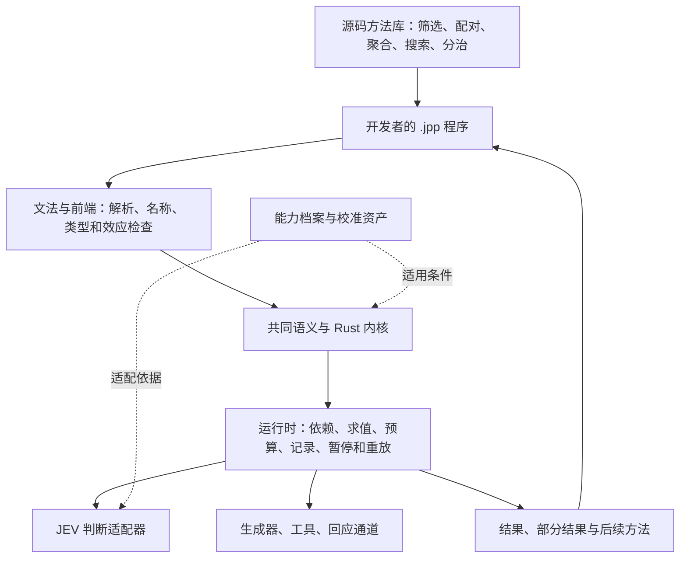

# J++ 总设计与交付地图

2026-09-23。本文把已有总计划、当前实现和最近探索放到同一张图上，作为阅读入口和阶段定位，不另立一套语言规范。状态是当日快照；下一段工作包是推进建议，没有在本轮启动实现或模型实验。

**J++ 已经有独立源码和可运行的 Rust 内核。现在要完成的是：让少量基础构造支撑一套真正可复用的求解方法，并使这些方法通过普通使用入口接上真实能力。** 原计划没有失效，也不需要从头再造一次语言。

下一段的具体代码起点、首包行为验收和连续交付顺序见 [实施任务](implementation-handoff-2026-09-23.zh-CN.md)。任务已准备，尚未启动。

## 1. 我们最终要交付什么

开发者安装 J++，编写 `.jpp` 程序，把问题、材料、求解方法与中间结果当作可操作的对象。程序能根据已有结果提出下一道问题，组合其他方法，利用精确算法求解；局部信息不足时，可以先交出有用结果，把剩余问题交给下一段程序继续处理。

这里的关键不是预装很多聪明功能，而是：**开发者写出的新方法也能成为别人的基础材料，不需要每增加一种应用就修改内核。** JEV 提供判断能力；确定性算法、生成器、工具和回应通道共同参与计算。未来接入其他后端仍沿这一分工，具体能力与校准是否兼容需由适配器和实测确认。

正式实现使用 Rust，用户写的是 J++。Python 保留作行为参照和已有应用实验；OCaml 可承担具体语义问题的探索，不形成第二套正式运行时。

## 2. 整体结构：每一层让下一层更容易被构造

图中包含目标职责，不表示各层已经全部完成。精确计算属于语言的普通计算能力，不必绕到模型中完成。

| 层 | 应负责什么 | 当前状态 |
|---|---|---|
| 源码与前端 | 人能写、拆分、导入程序，错误能定位到源码 | 已有独立语法、解析、检查、解释执行、多文件示例；检查覆盖仍是子集 |
| 共同语义与内核 | 问题、读数、方法、未决和外部效应在组合后仍有明确含义 | 已有高阶方法、动态问题、部分结果与续接；部分类型和源码接口还需补齐 |
| 执行系统 | 根据依赖运行，批量判断，记录成本与结果，恢复计算 | 惰性判断、同状态融合、部分提前登记与重放已有；完整规划、调度和跨程序缓存尚未交付 |
| 能力适配与反馈 | 同一程序使用真实判断、生成、工具与回应，并接收可用反馈 | Rust 宿主有真实 JEV client；当前 CLI 判断路径仍使用固定观察，真值到校准的使用链未闭合 |
| 方法库 | 用少量构造写出很多算法；算法可以接收和返回方法 | 有组合示例和小型源码库；语义集合构造与通用算法骨架仍明显不足 |
| 交付与工具 | 安装、编写、调试、复用、分享形成一条完整路径 | 公开原生快照已存在；研究版的新能力还在待合并更新中 |

### 最小构造不是把所有东西叫成“一个单元”

统一应保留重要差异。材料不是问题，模型读数不是已验证事实，方法也不等于执行一次方法。现行设计中这些对象的职责可以这样理解：

| 构造 | 输入与输出 | 如何继续组合 |
|---|---|---|
| 材料与状态 | 材料及上下文 → 本次判断的输入 | 可以由前一段计算产生，供不同问题使用 |
| 问题 | 判、选、量的题面与配置 → 问题值 | 可以传递给方法，并按运行中的结果构造下一题；完整反射接口未完成 |
| 判断与桥 | 状态 + 问题 → 读数 → 接受、忽略、选择、刻度或未决出口 | 出口控制后续计算；未决可以保留、转交或按策略处理 |
| 方法 | 输入、捕获的环境与其他方法 → 结果或新方法 | 简单方法与复合方法都能继续作为参数或返回值 |
| 部分结果与续接 | 已知结果 + 剩余问题 → 当前可用部分及后续计算 | 调用者使用已知部分，另一个策略继续剩余部分 |
| 外部效应 | 判断、生成、动作或请求 → 观察、材料、执行结果或等待状态 | 结果回到程序，成为新的输入；实际发生的调用由运行系统记录 |

规范中的六个 IR 形式 `state / judge / cut / gen / do / ask` 是共同语义的表达结构；普通函数、列表和控制流继续承担一般计算。它们不是“整个语言只有六个函数”的说法。

## 3. 放回原来的五步计划

沿用此前的“源码到运行 → 方法与结果组合 → 外部能力与生命周期 → 可复用程序与基础优化 → 整版交付”。各步允许交叠，不能用测试数量换算完成百分比。

| 原计划 | 当前到哪里 | 已产生的效果 | 剩余重点 |
|---|---|---|---|
| 1. 源码到运行 | **已跨过首版门槛** | `.jpp` 经解析、检查，由 Rust 实际执行；不依赖 Python 解释器 | 随后续能力补齐文法、诊断和安装说明 |
| 2. 方法与结果组合 | **主要路径已跑通，完整性仍需补齐** | 方法可传递和返回；问题可动态产生；部分结果可使用并续接 | 实际程序暴露的类型、效应和问题接口缺口 |
| 3. 外部能力与生命周期 | **运行机制已有，用户接入未闭合** | 预算、账本、重放、宿主适配已有实现 | CLI 真实后端、输入输出、回应与反馈的完整使用路径 |
| 4. 可复用程序与基础优化 | **局部实现，当前主要建设面** | 小型源码库和若干执行优化可用 | 语义集合操作、跨算法复用、由程序驱动的优化补缺 |
| 5. 整版交付 | **已有早期公开版，当前整版未完成** | 别人能取得原生源码快照与文法 | 研究功能整合、同版本文档、完整例子与可安装发行 |

当前不是单纯“只有一些 Python 函数”，也还不是“语言主体已经完整，剩下做展示”。更准确的位置是：**独立语言的执行基础已经建立，正在补第 3、4 步，并把成果收进第 5 步。**

## 4. 最近的工作产生了什么效果

### 已跑通的行为

9 月 23 日已有验证记录针对本地研究树 `520fef2`：315 项测试通过、0 失败、3 忽略；四个源码程序和一次重放均正常结束。本次总图读取这些记录及对应代码，没有再把同一套测试重复跑一遍。详情见[当日进度说明](updates/2026-09-23-composable-foundation-status.md)。

这些程序展示了三种基础能力：

- **把解决方法当作输入和输出。** 多文件程序导入方法、调用方法，并得到可再次调用的方法。这使复用单位能够从某个小判断扩大到一整套求解策略。
- **程序自己决定下一道题。** 一个源码程序依据上一轮答案缩小范围，10 次固定观察从 1,000 个候选中定位 731。这里证明动态选问可以由源码表达；二分法本身是已有算法。
- **有些问题没解决，也能先给出有用结果。** 配置程序先给出成本为 9 的 A+B 方案，保留 C、D 未决；补足 C 的信息后改为成本为 2 的 C，D 继续交给后续策略。重放同一记录没有新增模型调用或重复本地检查。

这些是语言机制的实际效果。固定观察用于检查执行含义，不构成真实 JEV 准确率、速度或费用优势的证据。

### 修复让已有设计更忠实地执行

近期修复处理了方法身份遗漏捕获环境、实际调用发生后丢失记录、三值状态被压成两值、判断桥遗漏不确定区间等问题。它们的价值是让“组合后仍保留原来的含义”更可靠。记录读写、能力档案与校准的接线也向前推进了，但输出无标签观察不等于已经获得正确答案标签。

这些进展值得保留。与此同时，内核修复的增加不等于标准库也等量增长；两条建设线需要分别看。

### 探索提供了构造参照

最近整理的生态源码显示，其他开发者已有类型化问题组合、自适应算法、排序、匹配、聚类和不同后端。我们可以借用其中的成熟方法，并把不同结构的程序用作语言的验收材料。[生态复盘](updates/2026-09-23-ecosystem-reassessment.md)

这支持继续建设少量可组合基础，但不能据此把 J++ 缩成已有应用的功能集合。真正要追问的是：这些不同方法能否由共同构造表达，它们的产物能否继续组合，以及新的应用是否因此更容易长出来。

## 5. 旧设计怎样进入新实现

现行依据继续是 [12：IR 与类契约](../research/地基/12-IR与类契约-v0.1.md) 和 [13：Rust 实践修订](../research/地基/13-Rust实践反馈设计修订-v0.2.md)，冲突处按已采纳修订处理。独立 Rust 源码的施工决定已替代旧稿“无限期推迟表面文法”的排期。具体收尾沿用 [14：语言完整实施计划](../research/地基/14-实施计划-把语言做完整-v1.md)。

最需要收拢的地方是：早期“五个集合算子”描述的是要表达的能力，现行契约把一部分放进了库。不能只看函数同名就判定已经完成或实现错误。

| 原设计要求 | 现行分层中的位置 | 本轮确认的缺口 |
|---|---|---|
| 材料按判断分为接受、忽略、未决 | 判断/桥 + 可复用集合方法 | 普通布尔 `filter` 已有；完整三路语义筛选的可复用接口还缺 |
| 两组材料计算关系、构造组合 | 枚举/召回 + 关系问题 + 配对方法 | 尚无完整配对构造；不意味着一定要增加 `pair` 关键字 |
| 集合上的存在、全称、计数区间、排序 | 集合聚合库 | 现有 `agg` 合并读数，不等于已经交付这些集合能力 |
| 反馈、分治、搜索、选择策略 | 普通控制流 + 高阶方法 + 库骨架 | 已有个别程序；尚未形成跨算法可复用的一组完整方法 |

下一步补的是这些能力在现行结构中的对应物，保留已经有用的普通列表操作和读数聚合。仅在具体程序确实无法表达时调整内核。

## 6. 下一段怎样做，才能形成一个完整版本

以下工作包服务于原五步计划，不要求先完成全部研究问题，也不重新设置一轮全面架构评审。

**A．把已有成果整合到同一交付基线。** 明确研究版、待合并代码和主分支的差异；对已有更新完成针对性检查后整合。文法、能力表、安装说明与运行代码指向同一版本。已交付的东西只需整合，不重复开发。

**B．从不同算法里补出一组共同构造。** 以三路筛选、关系配对、集合聚合与未决续接为候选，选结构不同的程序共同实现。一个可以是关系发现，一个是候选搜索与精确检验，再用第三个未特制的问题检查复用。先允许有清楚的冗余，再提炼公共部分；抽象后仍要表达“任意一个／第一个／全部”“否定／未决”等原有差异。算法细节放在源码与库中。

**C．让这些源码直接使用真实能力。** 接通 CLI 到已有 Rust client 的路径，保留固定观察和重放。补齐所选程序需要的生成、动作或回应通道；把人工或独立检查产生的真值接到现有反馈资产，避免把模型自己的回答当标签。B、C 可在稳定接口上并行推进。

**D．交付一个能让人看懂的完整作品及安装包。** 优先沿用通爻的真实问题：输入需求和若干参与者材料，程序提出关系，构成候选组合；组合保留成员与依据，再参与下一轮发现。使用者看到的应是“为什么这个组合能形成、补了什么信息、下一轮产生了什么新组合”。目前已有 Python 应用探索，完整原生 J++ 路径仍待实现；它是通用语言的一项验收作品，不限定语言用途。

交付衡量围绕四件事：新作者能否用已有构造写出新程序；加入第二种算法是否少写了重复协调代码；换策略后重要差异是否仍然可表达；真实运行在同等目标下的质量、调用、等待和费用怎样变化。统计表达量时包含配套代码，不只数 `.jpp` 文件行数。优化针对程序里的实际瓶颈推进，未必等待所有规划 pass 完成才发实验版。

完整版本的最低使用路径是：**安装 → 自己写源码 → 导入现成方法 → 使用真实能力 → 得到结果或可继续处理的未决 → 查看记录并继续运行。**

## 7. 研究、公开代码与协作位置

本轮实时核对 GitHub：主分支为 `6cd44077`；[PR #25](https://github.com/Towow-ai/jpp/pull/25) 的 Rust 同步仍未合并；[PR #26](https://github.com/Towow-ai/jpp/pull/26) 的近期研究与进度说明也未合并。PR #25 描述的是较早的 302 测试快照，本地研究树已有后续提交和 315 测试记录，不能直接视为完全同步。本文随文档分支提交，不代表主分支运行代码升级。

沿用职责：Claude Code 承担主要 Rust 内核、适配与运行时实现；前端、源码库、使用路径与公开同步按已认领的工作包衔接；总控维护当前地图，在完整交付点检查效果和少数跨层决定。本轮没有向在途会话追加消息，也没有据历史记录判断某个 Agent 此刻仍在运行。

## English summary

J++ now has independent `.jpp` source and a working Rust interpreter. Its objective remains a small set of constructs from which developers can build methods, pass and return those methods, and compose intermediate results into further computation. JEV is a judgment backend alongside deterministic computation, generation, tools and response channels.

The original five-step plan is retained. Source execution has crossed its initial delivery milestone; major method-composition paths work. Current construction spans external integration and lifecycle support (step 3), reusable source libraries and targeted optimization (step 4), and consolidation into a usable release (step 5). This is not a completed general-purpose language body.

Existing September 23 research-workspace records at `520fef2` show 315 passing tests and source examples for composition, adaptive questions, partial continuation and replay. Those examples use fixed observations. This document inspected their records and selected source, without rerunning the full suite or measuring live-model quality or performance. The CLI still uses fixed observations, although a live Rust host client exists; label-to-calibration workflows and semantic collection libraries remain incomplete.

The next proposed packages consolidate delivered work, co-develop reusable constructs with structurally different algorithms, connect the real backend through the user-facing path, and deliver a complete application and installation flow. Early collection-operator requirements map into the current core/library split; existing boolean filtering and reading aggregation should not be declared incorrect merely because earlier documents used similar names. Research informs construction rather than imposing a new audit-first roadmap.

At inspection, GitHub main was `6cd44077`; runtime PR #25 and documentation PR #26 were open. The newer local research tree is not automatically an installed public release. This map updates documentation only and does not change language semantics or runtime behavior.
