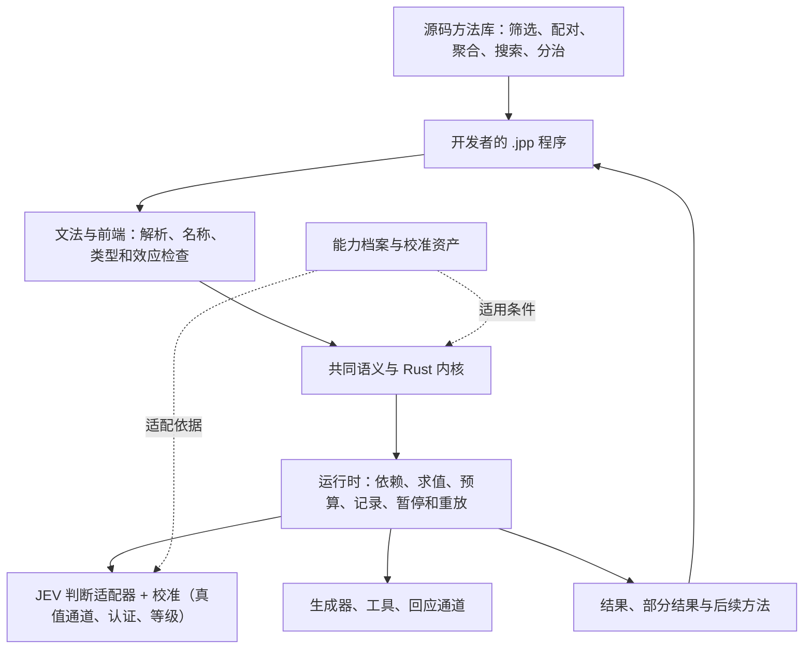

# J++ 总设计与交付地图

2026-09-24 按黑板重写（此前版本停在 09-23，多处陈述已过期）。本文把已有总计划、当前实现和最近发现放到同一张图上，作为阅读入口和阶段定位，不另立一套语言规范。状态是当日快照；下一段工作包是推进建议，不代表已启动实现。

**J++ 已经有独立源码、可运行的 Rust 内核、接通真实判断后端的校准流程。9 月 24 日的核心发现：内核语义在受控测试下成立，但在真实后端上，没有校准线的新题一律拿不到已决出口，一道题要约 160 条带真值标注才能认证出一条正式档的线。这是这门语言「便宜判断 + 校准阈值决定动作」这套机制的使用门槛，今天的设计工作主要就是在拆解它。** 原计划没有失效，也不需要从头再造一次语言；但"完成度"不能再只按代码行数或测试数判断，要看仪表读数。

下一段的具体代码起点、里程碑挂点见 [实施任务](implementation-handoff-2026-09-23.zh-CN.md)（仍是 09-23 定的起点，尚未按本文更新）。

## 1. 我们最终要交付什么

开发者安装 J++，编写 `.jpp` 程序，把问题、材料、求解方法与中间结果当作可操作的对象。程序能根据已有结果提出下一道问题，组合其他方法，利用精确算法求解；局部信息不足时，可以先交出有用结果，把剩余问题交给下一段程序继续处理。

这里的关键不是预装很多聪明功能，而是：**开发者写出的新方法也能成为别人的基础材料，不需要每增加一种应用就修改内核。** JEV 提供判断能力；确定性算法、生成器、工具和回应通道共同参与计算。未来接入其他后端仍沿这一分工，具体能力与校准是否兼容需由适配器和实测确认。

正式实现使用 Rust，用户写的是 J++。Python 保留作行为参照和已有应用实验。

## 2. 整体结构：每一层让下一层更容易被构造

图中包含目标职责，不表示各层已经全部完成。精确计算属于语言的普通计算能力，不必绕到模型中完成。

| 层 | 应负责什么 | 当前状态（本仓库 `main`） | 已造出、在同步分支待合入 | 只是裁定、任何分支都未造 |
|---|---|---|---|---|
| 源码与前端 | 人能写、拆分、导入程序，错误能定位到源码 | 已有独立语法、解析、检查、解释执行、多文件示例 | 前端直接降到中间表示（跳过旧核心语法树，`jpp-frontend` 改名 `jpp-syntax`），检查器抽成独立层 `jpp-check` | — |
| 共同语义与内核 | 问题、读数、方法、未决和外部效应在组合后仍有明确含义 | 高阶方法、动态问题、部分结果与续接、题成为一等值、三路过滤/配对/聚合/迭代、组合封闭性契约、值级 taint | 中间表示层 `jpp-ir`、逐跳来源追踪（parents/hop）、值级来源标签细化 | — |
| 执行系统 | 根据依赖运行，批量判断，记录成本与结果，恢复计算 | 惰性判断、同状态融合、预算停机、账本重放、批调度 | 账本改版 `jpp-ledger`（结构化键、头行字段扩充） | 并发端口（真机仍串行） |
| 能力适配与反馈 | 同一程序使用真实判断、生成、工具与回应，并接收可用反馈 | 真实 JEV client（`--backend live`）、`calib-import` 真值通道、拆分样本两侧认证、题式级线回退、漂移自动标记 + 人工确认 | 试用档校准等级（更少样本、可路由不放行）、逐出口记线等级、真机默认必须带能力画像（无画像不再兜底常数）、验收仪表脚本 | 固定序/序贯认证方法（把正式档门槛从约 160 条降到约 60 条）、范围扩展修法 |
| 方法库 | 用少量构造写出很多算法；算法可以接收和返回方法 | 有组合示例和小型源码库；三路过滤、配对、聚合已是可复用构造 | — | 首批共享题式库（落地后新题 0 行校准）、锦标赛/搜索骨架 |
| 交付与工具 | 安装、编写、调试、复用、分享形成一条完整路径 | PR #27–#30 已合入 `main`；`cargo test --workspace --offline` 394 通过、0 失败、3 忽略 | 报告模式 CI（跑 GUIDE/README/METHODS 代码片段与全部示例）；同步分支 `cargo test --locked --workspace` 579 通过、0 失败、3 忽略 | 一页纸新开发者指南、诊断机读输出（JSON、编号化运行期错误）|

### 最小构造不是把所有东西叫成"一个单元"

统一应保留重要差异。材料不是问题，模型读数不是已验证事实，方法也不等于执行一次方法。现行设计中这些对象的职责：

| 构造 | 输入与输出 | 如何继续组合 |
|---|---|---|
| 材料与状态 | 材料及上下文 → 本次判断的输入 | 可以由前一段计算产生，供不同问题使用 |
| 问题 | 判、选、量的题面与配置 → 问题值 | 可以传递给方法，并按运行中的结果构造下一题 |
| 判断与桥 | 状态 + 问题 → 读数 → 接受、忽略、选择、刻度或未决出口 | 出口控制后续计算；出口带着自己背后的证据等级（正式/试用/借用/仅夹具/无） |
| 方法 | 输入、捕获的环境与其他方法 → 结果或新方法 | 简单方法与复合方法都能继续作为参数或返回值 |
| 部分结果与续接 | 已知结果 + 剩余问题 → 当前可用部分及后续计算 | 调用者使用已知部分，另一个策略继续剩余部分 |
| 外部效应 | 判断、生成、动作或请求 → 观察、材料、执行结果或等待状态 | 结果回到程序，成为新的输入；实际发生的调用由运行系统记录 |

规范中的六个 IR 形式 `state / judge / cut / gen / do / ask` 是共同语义的表达结构；普通函数、列表和控制流继续承担一般计算。

## 3. 放回原来的五步计划

| 原计划 | 当前到哪里 | 已产生的效果 | 剩余重点 |
|---|---|---|---|
| 1. 源码到运行 | **已完成，稳定** | `.jpp` 经解析、检查，由 Rust 实际执行 | 随后续能力补齐文法与诊断 |
| 2. 方法与结果组合 | **主要路径已跑通** | 方法可传递和返回；问题可动态产生；部分结果可续接；集合级构造（过滤/配对/聚合/迭代）已可复用 | 搜索与分治骨架、跨算法复用样本仍少 |
| 3. 外部能力与生命周期 | **已接通，但可用性受校准门槛限制** | 真实后端、账本、预算、重放、校准真值通道都已实现；单靠正式档门槛，一道新题要约 160 条标注才有第一个已决出口；试用档已在同步分支造出，降低了这道门槛的一部分 | 固定序/序贯认证（把门槛压到约 60 条）已裁定、待写入代码；真机并发 |
| 4. 可复用程序与基础优化 | **局部实现** | 小型源码库、等价写法核对（防止同一程序两种写法调用数相差十几倍）已有 | 共享题式库、锦标赛/搜索骨架 |
| 5. 整版交付 | **公开快照已随日推进，架构重构在待合入的同步分支** | PR #27–#30 已合入 `main`；文档同步到 09-24 | 同日架构重构（3 拆 10 crate，上限 11）在 `sync/2026-09-24-architecture` 分支待审核合入；发行画像、可安装包 |

当前最准确的定位是：**独立语言的执行基础与真实后端已经打通，第 3 步的"可用性"受制于校准门槛，这是本轮设计工作的重点；第 4、5 步在它之后。**

## 4. 最近的工作产生了什么效果，发现了什么问题

### 已跑通的行为（合入 `main`）

PR #27–#30 把研究树的运行时增量、构造施工、真实后端、题式级校准、规则批（夹具线不放行、漂移自动标记、合并读数禁众数、判断力缺席处理、`unsure` 具名原因）与值级 taint 全部带进公开仓库。`cargo test --workspace --offline`：**394 通过、0 失败、3 忽略**。这些修复的价值是让"组合后仍保留原来的含义"更可靠，也堵上了两类放行方向缺陷（推测执行越过用户函数提前跑 `do`；不可信内容经拼接/join 被洗白）。

### 9 月 24 日的核心发现：接上真机之后才看见的门槛

真实后端接通后，任何没有校准记录的新题一律返回 `Unsure(cold)`——读数本身是对的，但出口拿不到已决结果，链式程序在第一层就停住。一道题要有一条正式档的线，需要约 160 条带真值标注；偏语义的题式要 200 条以上且不保证。这是这门语言「便宜判断 + 校准阈值决定动作」这套机制本身的使用门槛。一次独立复核（阶段评估）发现：内核语义在受控测试下成立，但现在还没有在真实后端上产生效果——三条验收标准（表达量比、深度、换判断器）目前都只有部分或没有真机证据。

### 针对这个问题做的三件设计工作（细节见对应更新文档）

1. **验收仪表七项 + 表达量比的量法修正。** 过去表达量比对照的 9–20 倍参考带其实只适用于手写基线也要自己实现审计、预算、合批、认证线这四件事的任务书；早期任务书让基线跳过了这些，比值自然只有 2 倍左右。任务对照现在分 T0（只写功能）/ T1（加四件事）两档，并把行数比改成按折行宽度归一后再算。仪表脚本与第一次两档多实现测量都已在研究工作区跑过（表达量比的具体读数暂不公布），其余六项已有可公开的读数：探针 2–5 倍、试写 1.2–1.5 倍、真机已决出口占比 0.255（14/55）、深度曲线一/二/三层 22/12/4；连同暂不公布的表达量比一项，仪表七项现在全部有数。详见[验收仪表与表达量参考系](updates/2026-09-24-dashboard-and-expressiveness-reference.md)。
2. **试用档校准等级，解除真机全冷的问题。** 比正式档门槛低得多的样本量即可认证出一条试用线：能分派路由，但明确不许放行不可逆动作，且已在同步分支造出。真机测试中，一个两层链式程序第一次拿到全部已决出口、第一次真机走到第二层。详见[真机试用档校准线](updates/2026-09-24-live-trial-lines.md)。
3. **把 160 条标注门槛本身降下来。** 拆解发现门槛里约一半是固定随机种子把样本切分不均造成的意外，不是真正要求；改用文献标准的固定序检验方法（离线用现有标注数据零成本验证过），可以把门槛降到约 60 条，安全边界不变。这项方法改动只写成了设计裁定，还没有实现进代码。详见[压低标注门槛](updates/2026-09-24-labeling-threshold.md)。

第 2 项（试用档校准、逐出口记线等级、真机必须带画像）已经造出，代码与同一天的架构重构（内核从 3 个 crate 拆到 10 个，上限 11）一起在同步分支 `sync/2026-09-24-architecture` 上，待审核后推送合入。第 3 项（固定序/序贯认证方法、范围扩展修法）只写进了设计裁定，任何分支都还没有代码。

## 5. 旧设计怎样进入新实现

现行依据继续是 [12：IR 与类契约](../research/地基/12-IR与类契约-v0.1.md) 和 [13：Rust 实践修订](../research/地基/13-Rust实践反馈设计修订-v0.2.md)，加上 9 月 23–24 两天新写入的一批裁定（校准键改为题式主键、值级 taint 契约、组合封闭性契约、校准等级分档等）。

| 原设计要求 | 现行分层中的位置 | 本轮确认的缺口 |
|---|---|---|
| 材料按判断分为接受、忽略、未决 | 判断/桥 + 三路过滤构造 | 已交付：`sieve` 直接吃题、三流出口，产物可再过滤 |
| 两组材料计算关系、构造组合 | 枚举/召回 + 关系问题 + 配对方法 | 已交付：`pair` 构造 |
| 集合上的存在、全称、计数区间、排序 | 集合聚合库 | 已交付：`tally`/`first_k`（计数区间、存在/全部三值出口）；搜索/锦标赛骨架仍缺 |
| 反馈、分治、搜索、选择策略 | 普通控制流 + 高阶方法 + 库骨架 | 有个别程序；跨算法可复用的完整方法集仍不足 |
| 线不能由程序自己写，只能来自带真值样本 | 校准子系统（真值通道、两侧拆分认证） | 已交付并接通真机；样本门槛过高是新发现的问题——试用档已造出（同步分支待合入），能大幅压低门槛的固定序/序贯认证方法已裁定未实现 |

## 6. 下一段怎样做，才能形成一个完整版本

**A．把已经造出的架构重构与试用档校准并入本仓库。** 同一天的 crate 拆分（3 拆 10，上限 11）、试用档校准等级、逐出口记线等级、真机必须带画像的规则、验收仪表脚本都已在同步分支 `sync/2026-09-24-architecture` 上测试通过（579 通过、0 失败、3 忽略），待审核后推送、开 PR、按依赖顺序合入，同时保持公开侧已有的审查修复不被覆盖。

**B．把固定序/序贯认证方法写进代码。** 这一项与 A 不同：A 是把已经造出的代码合并进来，这一项是先把已裁定但尚未实现的固定序检验方法、序贯变体、范围扩展修法写成代码，再合入。写完之后，"新题可用"的成本会从约 160 条标注降到约 60 条，这是当前对用户体验影响最大的一段。

**C．把仪表读数系统性公布。** 七项读数已经在研究工作区跑出，包括按 T0/T1 两档做的第一次表达量比多实现测量；这次同步只公开了六项里能给的数字（探针比值、真机已决出口率、深度曲线等），表达量比的具体读数留到下一次公开更新一并发布，而不是继续只引用孤立探针的印象性数字。

**D．继续扩大集合级方法库与真实场景验证。** 优先沿用通爻的真实问题：输入需求和若干参与者材料，程序提出关系，构成候选组合。目前已有 Python 应用探索，完整原生 J++ 路径仍待实现。

交付衡量围绕四件事：新作者能否用已有构造写出新程序；加入第二种算法是否少写了重复协调代码；换策略后重要差异是否仍然可表达；真实运行在同等目标下的质量、调用、等待和费用怎样变化。

完整版本的最低使用路径是：**安装 → 自己写源码 → 导入现成方法 → 标一批真值、拿到可用校准线 → 使用真实能力 → 得到结果或可继续处理的未决 → 查看记录并继续运行。**

## 7. 研究、公开代码与协作位置

主分支 `main` 已包含 PR [#27](https://github.com/Towow-ai/jpp/pull/27)、[#28](https://github.com/Towow-ai/jpp/pull/28)、[#29](https://github.com/Towow-ai/jpp/pull/29)、[#30](https://github.com/Towow-ai/jpp/pull/30)。`cargo test --workspace --offline`：394 通过、0 失败、3 忽略。研究树今天（9 月 24 日）的架构重构与试用档校准工作在同日同步分支 `sync/2026-09-24-architecture` 上（同步到研究树提交 `9716e61b`，`cargo test --locked --workspace` 579 通过、0 失败、3 忽略），待审核后推送并合入，与本仓库测试数、crate 数不是同一个基线；固定序/序贯认证方法则只有设计裁定，任何分支都还没有代码。下次同步应按依赖顺序整理后再合，且保留公开侧已有的审查修复。

沿用职责：主要 Rust 内核、适配与运行时实现在研究树完成、按依赖顺序同步进本仓库；前端、源码库、使用路径、文档按已认领的工作包衔接；关键设计裁定（如今天的校准等级分档、认证方法改动）由独立评审给出，写入依据文本后排期实现。

## English summary

J++ now has independent `.jpp` source, a working Rust interpreter, and a real JEV backend wired through a calibration pipeline. PRs #27-30 merged into `main` today (2026-09-24): the live backend, first-class questions, the sieve/pair/tally/iterate construct family, the composition-closure contract, value-level taint, and a five-item rule batch. `cargo test --workspace --offline`: 394 passed, 0 failed, 3 ignored.

The headline finding from today's work: once connected to the real backend, every new question without a certified calibration threshold returns an explicit undecided outcome, and getting a threshold at the existing formal safety bar takes roughly 160 labeled examples. An independent review found the kernel's semantics hold under controlled tests but had not yet produced an effect on the live backend, against the project's three acceptance criteria (shorter to write, how deep a judgment chain runs, swapping the backend without changing the program) -- each currently has partial or no live evidence. Three pieces of design work responded: a two-tier task methodology that corrected how the expressiveness ratio is measured against its 9x-20x literature target, with a first multi-implementation measurement run in the research workspace (reading not published here) and six of the resulting seven dashboard items already public; a looser "trial" calibration tier, along with per-exit line-grade reporting and a required-profile rule, that unblocked a two-layer program on the live backend for under a fifth of a cent; and an analysis that found a path to cut the labeling requirement to about 60 examples by replacing a costly split-sample certification method with a literature-standard fixed-sequence method, validated for free against existing data. The trial-calibration work is built, on the same-day sync branch `sync/2026-09-24-architecture` (synced through research-tree commit `9716e61b`; `cargo test --locked --workspace`: 579 passed, 0 failed, 3 ignored), pending review before being pushed and merged. The fixed-sequence/sequential certification method and a related scope-extension fix are written design decisions only; neither is built in any branch yet. The same-day architecture refactor (3 kernel crates to 10, with a ruled cap of 11, and a rebuilt intermediate representation and ledger format) is on that same sync branch.

The next steps are to push and merge the sync branch's already-built work in dependency order, implement the fixed-sequence/sequential certification method and merge it separately, and publish the remaining dashboard reading -- the actual gap, if any, between J++'s measured expressiveness ratio and its 9x-20x target band, which is not yet a public number.
