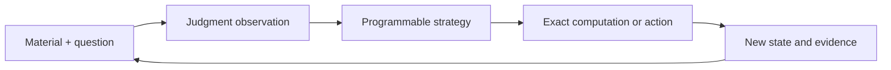

# J++ design / 设计方向

## Read the language specifications / 阅读语言规范

**The grammar design exists.** The archived language specification contains lexical rules (§1), a full EBNF proposal (§2), types, semantics and example programs. It is a historical design study, not syntax accepted by the current implementation. The current design makes semantic judgment a first-class effect in a general-purpose language, using an IR and a Python builder; independent surface syntax is deferred indefinitely.

**文法设计已经存在。** 历史语言规范包含词法（§1）、完整 EBNF 提案（§2）、类型、语义和示例程序。它已归档为设计研究，不是当前实现可解析的源码语法。现行方向是以语义判断为一等效应的通用语言，采用 IR 与 Python 构建器，独立表面文法无限期推迟。

| Read / 阅读 | Status and contents / 状态与内容 |
|---|---|
| [Current IR and class contract / 现行 IR 与类契约](../research/地基/12-IR与类契约-v0.1.md) | §2 six IR forms; §3 type/checker rules; §4 passes; §6 Python builder; §9 build order. Design requirements and dated research states are not a claim that every requirement has shipped. / 六形式、类型纪律、编译 pass、构建器及建造顺序；规范中的要求和历史研究状态不等于全部已交付。 |
| [Archived language specification and EBNF / 历史语言规范与 EBNF](../research/地基/11-语言规范-v1.md) | Earlier standalone surface-language proposal, retained for design history; no delivered parser or standalone compiler for this grammar. / 早期独立源码语言提案；尚未交付解析该文法的 parser 或独立编译器。 |
| [Design decisions / 设计决策记录](../research/地基/DECISIONS.md) | Records the move from the surface-language proposal to the IR-first route. / 记录从表面文法转向 IR 先行的决策。 |
| [Write and debug methods / 编写与调试方法](developer-guide.md) | Current composition API, executable examples and plan inspection. / 当前组合 API、可执行例子与计划检查。 |
| [Research index / 研究索引](../research/README.md) | Original Chinese specifications, algebra, reviews and experiment records. / 中文规范原件、组合代数、评审与实验记录。 |

The project intent is to use Python to run concrete examples and algorithms first, then develop an independent language. “Deferred indefinitely” records the current contract's scheduling decision, not a permanent decision to stay in Python. The future language's syntax, migration path and implementation remain to be designed and delivered.

项目意图是先用 Python 跑通具体实例和算法，再发展独立语言。“无限期推迟”记录的是现行契约中的排期决定，并不表示永久停留在 Python。未来语言的语法、迁移方式与实现仍需设计和交付。

## What source looks like today / 当前源码怎样写

Programs are Python source. The builder is exported by [`foundation.jv`](../src/foundation/jv/__init__.py); Python supplies functions, data structures and control flow. The six IR forms below describe semantic operations, **not a separate source-parser grammar**. For full builder programs, read §6 of the current contract and the [kernel guide](../src/foundation/jv/README.md).

程序目前写成 Python 源码，由 `foundation.jv` 构建器提供语言操作，函数、数据结构和控制流沿用 Python。下面六形式是语义操作的结构，**不是独立源码解析器的文法**。完整构建器程序见现行规范 §6 与[内核指南](../src/foundation/jv/README.md)。

| IR form / 形式 | Role / 作用 |
|---|---|
| `state` | Build material slots (`on`, `ctx`, `ref`, `over`). / 将材料组装为具名槽。 |
| `judge` | Evaluate `test`, `select` or `measure` questions and produce readings. / 执行判、选、量问题，产生读数。 |
| `cut` | Convert a reading through calibration into a typed exit. / 通过校准把读数转成带类型出口。 |
| `gen` | Produce candidate materials through a generator. / 通过生成器产生候选材料。 |
| `do` | Run a declared action and record its result. / 执行已声明动作并记录结果。 |
| `ask` | Request a human answer; suspend with `Pending` when unavailable. / 请求人答，无答案时以 `Pending` 挂起。 |

`Mat`, `Q` and `State` represent material, questions and slotted state. `judge` returns `Readings`; raw readings are not ordinary numbers for host arithmetic. `cut` exposes `Act` / `Ignore`, `Pick`, `At`, or `Unsure`; failures use `Fail`, and human-answer suspension uses the program-level `Pending`. `transform` records host material transformations; `fit` is a registered library bridge. Neither adds a seventh core IR form. See the [type definitions](../src/foundation/jv/ir.py) and current contract §2–3.

`Mat`、`Q`、`State` 分别表示材料、题和具名槽状态。`judge` 返回 `Readings`，原始读数不能当普通数字直接做宿主算术；`cut` 给出 `Act` / `Ignore`、`Pick`、`At` 或 `Unsure`。失败由 `Fail` 表示，人答挂起走程序级 `Pending`。`transform` 记录宿主材料变换，`fit` 是注册的库桥，均不另增核心 IR 形式。具体约束见类型定义及现行规范 §2–3。

Execution follows Python control flow. `judge` and `do` use lazy handles and dependency-driven flushing; `gen` and `ask` execute immediately as specified in §6.0. Budget checks, calibration, unresolved-exit consumption and replay are runtime concerns; the checker catches a defined subset before execution. The composition library builds reusable methods on top of this kernel. See [implementation scope](status.md), [verification](verification.md) and the [composition API](composition.zh-CN.md) for delivered behavior and its limits.

执行沿用 Python 控制流。`judge` 与 `do` 使用惰性句柄，按依赖和需求刷新；`gen` 与 `ask` 按 §6.0 即时执行。预算、校准、未决出口消费和重放由运行时处理，检查器提前捕获规定范围内的问题。组合库在内核上构造可复用方法，已交付行为及边界见实现范围、验证记录与组合 API。

## Composition principle / 组合原则

The unit of reuse is a computation with an input, an output, and declared effects. Combining computations produces another computation with the same external interface. Questions and methods can both be passed as values.

复用的基本单元是一段有输入、输出和效应声明的计算。组合的结果仍然是一段同样接口的计算。问题和方法都能作为值传递。

## Three cooperating layers

1. **Host computation / 宿主计算**: Python performs exact arithmetic, data manipulation and algorithmic checks.
2. **Judgment runtime / 判断运行内核**: `foundation.jv` represents materials, questions, judgments, exits, generation and actions. It tracks execution and budgets.
3. **Composition / 组合层**: `jev_compose` provides a uniform Component interface and reusable algorithm constructors.

An unresolved observation is represented explicitly. A caller can seek new evidence, retain several candidates, or continue exact calculations that do not depend on that observation. Accepted model judgments remain assumptions about the world; composing them does not turn them into mathematical truth.

## Why these demonstrations?

Adaptive inquiry shows that the next question is programmable. Counterexample feedback shows that a judgment can prioritize a candidate while an exact checker determines whether it meets a declared finite specification. Both return ordinary components that can be reused by other methods.

自适应提问体现“下一道问题也可以编程”；反例反馈体现“判断负责安排尝试，精确检查负责验证指定条件”。它们共用组件与迭代机制，没有单独发明两套执行器。

Binary search and counterexample-guided search are established algorithms. J++ explores a reusable language interface for combining such algorithms with semantic operations; it does not claim to invent those algorithms.

## Language versus implementation

The language goal is broader than the current Python implementation. The historical grammar is available above, but the current contract defers independent surface syntax indefinitely while the IR, builder and working compositions are developed. No standalone lexer/parser/compiler for that historical grammar has been delivered in this release.

语言目标比当前 Python 实现更广。历史文法可直接阅读；当前契约仍将独立表面语法无限期推迟，先完善 IR、构建器与可运行组合。本版本没有交付针对历史文法的独立词法器、解析器或编译器。

See [composition API in Chinese](composition.zh-CN.md) for exact current operations.
