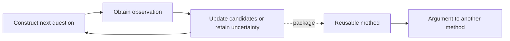

# Why we are building J++

[中文](why-jpp.zh-CN.md) · [Run it](../README.md) · [Progress](progress.md)

We want to build a language in which a small set of operations can grow into solving methods its designers did not anticipate. JEV prompted a concrete question: if a program can submit material and a question to a model and receive a judgment it can compute with, what happens when that judgment becomes a programmable operation?

Could questions become reusable values? Could methods accept other methods? Could a composition become an ordinary building block in a larger composition? That is the intuition behind J++. We do not yet know its final form, but the idea is concrete enough to implement and put into other people's hands.

## The power that interests us

Consider 1,000 candidates with exactly one target. With reliable binary answers, balanced questions can identify it in at most ten steps. Ten binary outcomes distinguish 1,024 possibilities. The organization of the questions changes the work required.

The poisoned-bottle puzzle illustrates a related information argument. With one observation round and only alive/dead outcomes, ten mice can distinguish 1,000 possibilities; eight can distinguish at most 256. Changing the possible observations changes the problem. We are interested in that relationship between primitive operations, available information and algorithmic structure.

Binary search is one example. Search, dynamic programming, constraint solving and program synthesis all demonstrate the power of organizing computation. We want semantic judgment to cooperate with these methods.

A model judgment does not have the certainty of arithmetic. The language should express which results were computed exactly, which depend on an observation, where more evidence is needed, and which part remains unresolved. Those distinctions should be available to programs.

## Questions and methods as values

A growing application often accumulates code for selecting material, asking questions, generating candidates, checking them and using feedback. We want the reusable parts to become methods that can be passed around and composed.

Imagine one method selecting a question to distinguish candidates, and another acquiring missing evidence. The first can call the second when an answer is unresolved, then continue. Package the process, and a larger method should be able to call it through the same kind of interface.

The central requirement is that a composition remains composable. Its internal complexity can increase without forcing every caller to understand every internal step.

## What we learn from other languages

Language design offers examples of choosing what programs should express directly. Stroustrup describes wanting to write efficient systems programs in the styles encouraged by Simula. This puts expressive abstraction and practical execution into the same design problem. [Stroustrup's FAQ](https://stroustrup.com/bs_faq.html)

Move provides another example: abilities such as `copy` and `drop` control what can happen to values, with requirements extending through composite types. Our takeaway is that an important property can be supported by language rules and preserved through composition. [The Move Book](https://move-language.github.io/move/abilities.html)

These examples do not establish that J++ will succeed. They help us ask our own question: what support should a language provide for semantic judgments, question values, solving methods and unresolved observations?

We started with a Python embedded implementation so executable programs could reveal the necessary rules. Standalone `.jpp` source now runs through one Rust kernel, including method composition, adaptive inquiry and partial-result continuation. The [native package](../rust/README.md) documents what is implemented; the Python programs remain useful behavior references.

## From a judgment to a reusable algorithm

One JEV call answers a question. An algorithm chooses it, decides when to ask, interprets the observation and selects the next computation. J++ aims to make those organizational choices reusable.

The expression example runs a small complete cycle: generate candidates, select a trial, execute checks, return a failing input as a counterexample, and generate again. An exact check determines whether the expression satisfies the declared inputs. Better models or generators should be usable within the same composition structure.

JEV does not need to supply every capability. Search algorithms, solvers, retrieval, generative models and ordinary code can cooperate. The language expresses their interfaces and execution relationships. JEV is our starting point; backend evolution is part of the direction.

## The software we hope this enables

We imagine an exploration environment where someone supplies a goal, material and checkable conditions. A program constructs candidates, chooses useful questions, runs tools for evidence, and saves methods that made progress. Another program can reuse the method or replace one strategy inside it.

In code construction, this could combine candidate generation with execution feedback. In investigation, it could organize evidence acquisition and reuse investigation methods. In planning, it could connect semantic requirements to exact constraints. These are application directions, not completed products in this alpha.

The more interesting uses may come from others. We want to see whether methods can be reused, strategies exchanged locally, and new algorithms added without kernel changes, and whether larger programs become easier to understand and run.

## Where we are

The public alpha includes a runtime, composition library and offline demonstrations. Questions can be saved and restored. Components can be sequenced, branched, iterated and selected dynamically. Adaptive inquiry and counterexample feedback share a component interface. A separately authored allocation method can join those compositions.

The demo identifies a target among 1,000 candidates in ten questions, then constructs an absolute-value expression in three trials and executes all nine declared inputs. Observations are synthetic and generation uses finite enumeration. The example tests the mechanism; real-model quality needs separate evaluation.

Next comes clearer interfaces, more independent methods, live-backend evaluation and executable language rules. The [progress page](progress.md) distinguishes the published snapshot from ongoing research.

We are opening the project so the intuition can encounter real use. Build a method the examples do not contain. Put it inside another method. Show us where composition works and where you still need repeated glue code. Those programs will help determine what J++ becomes.
