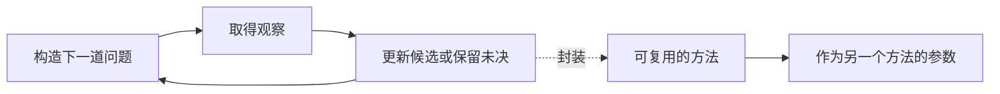

# 为什么我们要构建 J++

[English](why-jpp.md) · [运行它](../README.zh-CN.md) · [当前进度](progress.md)

我们想做一门语言，让人用少量基本操作，构造出设计者没有预先想到的求解方法。JEV 让我们重新认真思考这件事：如果程序能把材料和问题交给模型，得到可以继续计算的判断，那么“判断”能不能成为一种足够有用的基本操作？围绕它，能不能长出问题的组合、方法的组合，以及组合的组合？

这就是 J++ 的起点。我们还不知道它最后会长成什么样，但这个直觉已经足够具体，值得写成程序、拿给别人使用，再看它能够走多远。

## 让我们兴奋的是算法组织信息的力量

想象有 1,000 个候选，只有一个是目标。如果每次都能得到可靠的是非回答，合理地划分候选，最多十次回答就能定位它。十个二元结果可以表示 1,024 种情况；同样是提问，问题如何组织，会彻底改变需要付出的工作量。

毒酒与老鼠的经典故事表达了类似的力量。在每只老鼠只有生或死、只观察一轮的设定下，十只可以区分 1,000 种情况，八只最多区分 256 种。改变观察轮数或增加可识别的结果，能力又会改变。我们感兴趣的，正是基本操作、信息条件与组织方式之间的关系。

二分只是一个入口。搜索、动态规划、约束求解、程序合成，都让我们看见：复杂问题可以因为表达方式和算法结构的变化，变得更容易处理。J++ 想探索的是，当语义判断也成为可调用的操作时，这些方法可以怎样与它共同工作。

模型的回答不像数学公理一样可靠。这引出了语言需要表达的新内容：哪些结果已经精确算出，哪些仍依赖某次判断，哪里需要补充材料，哪一小块暂时不确定。我们希望这些区别可以被程序操作，而不必散落在每一个应用的临时代码里。

## 我们想把什么放进语言

假设程序需要从许多方案里选出可行方案。最直接的写法是准备材料、调用模型、读取答案，再决定下一步。随着任务复杂起来，开发者还会写出如何拆问题、如何选择下一问、如何生成候选、如何检查候选、如何吸收失败反馈。

这些事情经常被写在具体应用内部。我们想提取其中可复用的部分，让程序能接收“一种提问方法”，返回“另一种检查方法”，或者根据当前结果构造下一道问题。问题本身应该可以保存、传递、修改和组合；求解方法也应该如此。

例如，一个方法负责提出最能区分候选的问题，另一个方法负责补充材料。前者遇到未决结果时，可以调用后者，再继续缩小候选范围。把这一整段封装以后，它应当仍然是一种方法，可以被更大的搜索或规划程序调用。

这里最关键的设计要求是：组合以后，对外仍然使用能够继续参与组合的接口。复杂性可以不断增加，而使用者不必重新理解每个组件的全部内部实现。

## 为什么我们会把它叫作语言

我们从以前的语言里得到了一种设计上的启发：认真选择程序应该直接表达什么，会影响人们能够方便地构造什么。

Stroustrup 在解释 C++ 的起点时，谈到他希望用 Simula 鼓励的方式编写高效的系统程序。这提醒我们，抽象的表达能力与实际执行的要求可以成为同一个设计问题。[Stroustrup FAQ](https://stroustrup.com/bs_faq.html)

Move 提供了另一个具体例子。它通过 `copy`、`drop` 等类型能力规定值能否被复制或丢弃，并让这些要求沿组合结构成立。我们从中得到的启发是：当一种性质重要到许多程序都依赖它时，可以把它放进语言规则，让组件的组合也保留这项性质。[Move Book](https://move-language.github.io/move/abilities.html)

这两种语言并不能替我们证明 J++ 的方向。我们自己的设计问题是：语义判断、问题值、求解方法和未决结果，值得获得怎样的语言支持？哪些规则能让它们更容易组合？哪些事情交给成熟的宿主语言就已经很好？

当前实现从 Python 嵌入式语言开始。我们先把运行规则与组合接口做出来，让真实程序暴露设计问题。独立语法应当服务于已经看清的表达需求。Rust、OCaml 或其他实现语言的选择，也应当由具体运行需求推动。

## 为什么一次 JEV 调用还不够

一次调用回答一道问题；一个算法决定问什么、何时问、如何利用答案，以及接下来做什么。我们希望 J++ 能让后面这些组织方式被反复使用。

现在的表达式示例已经展示了一个小而完整的循环：生成候选，安排检查，实际运行指定输入，把失败输入作为反例交回生成器，再尝试新的候选。最终是否满足这组输入，由精确检查决定。将来换成更强的模型或更好的候选生成器，应该可以继续使用同一类组合结构。

我们不会要求 JEV 单独承担全部能力。搜索算法、求解器、检索器、生成模型和普通代码，都可能成为协作部件。语言需要规定它们如何交接材料与结果，如何调用，以及如何继续组成更大的方法。JEV 是项目的起点，语言的设计目标允许判断后端继续发展。

## 我们希望出现怎样的软件

我们想看到一种探索环境：使用者给出目标、材料和可检查的条件，程序构造候选、挑选下一道问题、运行工具取得新证据，并把取得进展的方法保存下来。下一次面对类似问题时，可以复用整段方法，也可以只替换其中的提问或验证策略。

把它用在代码上，可能形成不断提出候选、用执行结果改进候选的构造工具；用在调查与分析上，可能形成知道下一步该查什么、并能复用调查方法的软件；用在设计与规划上，可能把语义要求和精确约束放进同一个求解过程。这些是我们想走向的应用方向，目前 alpha 还没有交付这些完整产品。

更值得期待的应用，也许会来自别人。我们希望基本部件足够清楚，别人可以拿它们构造我们没有想到的结构。那时，判断项目价值的依据会很具体：方法能否被他人复用，替换策略需要改多少代码，新算法是否必须修改内核，复杂程序是否更容易理解和运行。

## 我们已经开始怎样验证这个直觉

首个公开 alpha 包含运行内核、组合库和离线示例。问题可以保存和恢复，组件可以接续、分支、迭代，并根据结果选择下一段方法。自适应提问和反例反馈共用组件接口；另一个独立编写的预算分配方法也能够接入组合。

离线演示会从 1,000 个候选中用十次提问定位目标，然后经过三轮尝试构造绝对值表达式，执行全部九个指定输入。它使用合成判断数据与有限枚举生成器，目的是让每个人都能运行和理解这套机制。真实模型的判断质量，仍需要独立的数据与实验。

接下来的工作包括把问题、材料、三种题型和未决结果的接口讲清楚，让新使用者少猜一步；让更多不同算法接进来；把真实后端的测量与语言组合结合起来；逐步写出可以执行、可以检验的语言规则。[进度页](progress.md)区分当前公开版本与研究中的工作。

我们选择现在开源，是希望让这个直觉尽早遇到真实使用。你可以从一个小问题开始：写出一种现有示例没有的求解方法，把它接入另一个方法，再告诉我们哪里顺手、哪里仍然需要大量重复代码。J++ 最终会成为什么，就在这些具体程序里逐渐显现。
